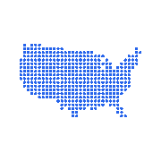

### Julie
**Middle Frontend Engineer** · React · Next.js · TypeScript

  <a href="#english"><b>🇬🇧 EN</b></a> · <a href="#russian"><b>🇷🇺 RU</b></a>

---

*Fintech interfaces by day, open-source side projects by night.*

---

## Selected work

| | Project | What it proves                                                                                                              |
|:---:|:---|:----------------------------------------------------------------------------------------------------------------------------|
|  | **[EcoTrackr](https://ecotrackr-beta.vercel.app/)** · [code](https://github.com/CodingJulie/ecotrackr) | PWA · Gemini AI · Web Workers · [@ecotrackr/co2-calculator](https://www.npmjs.com/package/@ecotrackr/co2-calculator) on npm |
| <picture><source media="(prefers-color-scheme: dark)" srcset="./assets/icons/visa-guide-dark.png"><source media="(prefers-color-scheme: light)" srcset="./assets/icons/visa-guide-light.png"></picture> | **[VisaGuide](https://visa-guide-seven.vercel.app/)** · [code](https://github.com/CodingJulie/visa-guide) | Rule engine · CMS admin · PDF export · bilingual PWA                                                                        |
|  | **[Lockbox](https://lockbox-sigma.vercel.app/)** · [code](https://github.com/CodingJulie/lockbox) | Zero-identity auth · SHA-256 · Supabase RLS · social impact                                                                 |

---

## Work experience

**Middle Frontend Engineer** — outsourcing fintech.

Frontend for **banking** and **stock exchange** products (client details under NDA):

`React` · `TypeScript` · `Redux` · `Module Federation 5` · `REST API` · `WebSocket` · `Vitest` · `Playwright`

UI from approved design mockups — pixel-accurate implementation in banking & exchange flows ▸ Backend integration via **REST API** ▸ Real-time market data via **WebSocket** ▸ **Electronic signing** for banking documents ▸ Microfrontend modules with **Module Federation 5** ▸ Global state with **Redux** ▸ **Vitest** unit tests & **Playwright** e2e coverage

---

## Side project highlights

Built across open-source pet projects:

Initial load optimization — code splitting & dynamic imports ▸ Tree-shakeable modules — published [@ecotrackr/co2-calculator](https://www.npmjs.com/package/@ecotrackr/co2-calculator) on npm ▸ Gemini AI — server-side routes with graceful fallback ▸ Analytics dashboards — charts, heatmaps, progress UI ▸ Multi-step form UX — validated questionnaires with Zod

---

## Stack I ship with

`React` · `TypeScript` · `Redux` · `Module Federation` · `Next.js` · `Vitest` · `Playwright` · `Supabase` · `PWA` · `i18n`

---

## Background

Master's in **Instrumentation Engineering** + Bachelor's in **IT** — engineering background, moved into frontend development.

---

*Fintech interfaces by day, open-source side projects by night.*

  <a href="#english"><b>🇬🇧 EN</b></a> · <a href="#russian"><b>🇷🇺 RU</b></a>

---

*Днём — fintech-интерфейсы, ночью — open-source pet-проекты.*

---

## Избранные проекты

| | Проект | Что доказывает |
|:---:|:---|:---|
|  | **[EcoTrackr](https://ecotrackr-beta.vercel.app/)** · [код](https://github.com/CodingJulie/ecotrackr) | PWA · Gemini AI · Web Workers · [@ecotrackr/co2-calculator](https://www.npmjs.com/package/@ecotrackr/co2-calculator) на npm |
| <picture><source media="(prefers-color-scheme: dark)" srcset="./assets/icons/visa-guide-dark.png"><source media="(prefers-color-scheme: light)" srcset="./assets/icons/visa-guide-light.png"></picture> | **[VisaGuide](https://visa-guide-seven.vercel.app/)** · [код](https://github.com/CodingJulie/visa-guide) | Rule engine · CMS-админка · PDF-экспорт · двуязычная PWA |
|  | **[Lockbox](https://lockbox-sigma.vercel.app/)** · [код](https://github.com/CodingJulie/lockbox) | Zero-identity auth · SHA-256 · Supabase RLS · social impact |

---

## Опыт работы

**Middle Frontend Engineer** — аутсорсинг, fintech.

Разработка frontend для **банковских** и **биржевых** продуктов (детали клиентов под NDA):

`React` · `TypeScript` · `Redux` · `Module Federation 5` · `REST API` · `WebSocket` · `Vitest` · `Playwright`

Вёрстка по утверждённым макетам — точная реализация банковских и биржевых экранов ▸ Интеграция с backend через **REST API** ▸ Real-time рыночные данные через **WebSocket** ▸ **Электронное подписание** банковских документов ▸ Микрофронтенды на **Module Federation 5** ▸ Глобальный state на **Redux** ▸ Unit-тесты **Vitest** и e2e на **Playwright**

---

## Вклад в pet-проекты

Реализовано в открытых side-проектах:

Оптимизация первой загрузки — code splitting и dynamic imports ▸ Tree-shakeable модули — npm-пакет [@ecotrackr/co2-calculator](https://www.npmjs.com/package/@ecotrackr/co2-calculator) ▸ Gemini AI — server-side routes с graceful fallback ▸ Аналитические дашборды — графики, heatmap, progress UI ▸ Multi-step form UX — валидируемые опросники на Zod

---

## Стек

`React` · `TypeScript` · `Redux` · `Module Federation` · `Next.js` · `Vitest` · `Playwright` · `Supabase` · `PWA` · `i18n`

---

## Образование

Магистратура **«Приборостроение»** + бакалавриат **«Информационные технологии»** — инженерный бэкграунд, перешла в frontend.

---

*Днём — fintech-интерфейсы, ночью — open-source pet-проекты.*

  <a href="#english"><b>🇬🇧 EN</b></a> · <a href="#russian"><b>🇷🇺 RU</b></a>

